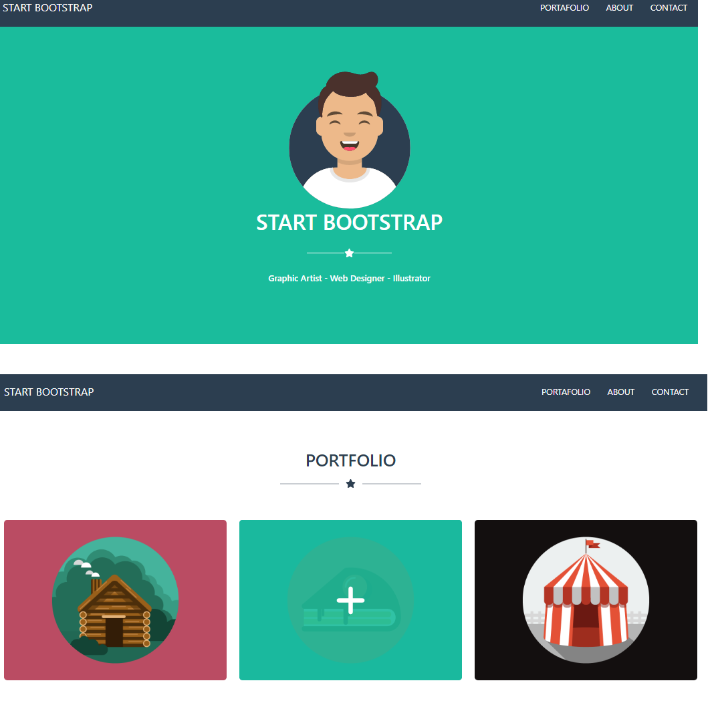

# Bootstrap page with REACT

[WITP](https://bootstrap-page-01.netlify.app): React app created with Vite [Vite](https://vitejs.dev/) that use [Bootstrap librery](https://react-bootstrap.github.io/) 

## App Live Demo

[](https://app.netlify.com/sites/bootstrap-page-01/deploys)

👉 https://bootstrap-page-01.netlify.app
---



---
## Project setup
```markdown
# Install
npm install

# Compiles and hot-reloads for development
npm run dev

# Compiles and minifies for production
npm run build

# Preview production version
npm run preview

```

---